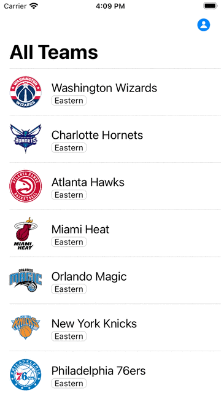
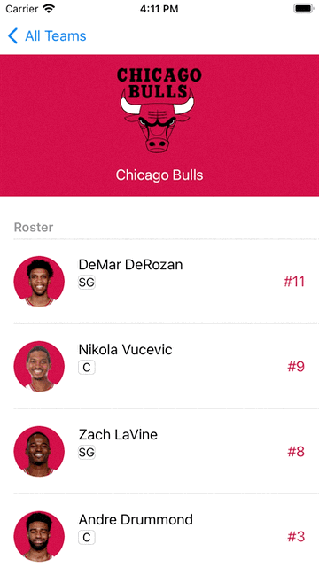

#  BASIC NBA APP 

<table>
  <tr>
    <td>teams tableview</td>
    <td>teams detail (roster tableview)</td>
    <td>player detail</td>
  </tr>
  <tr>
    <td></td>
    <td></td>
    <td></td>
  </tr>
</table>

